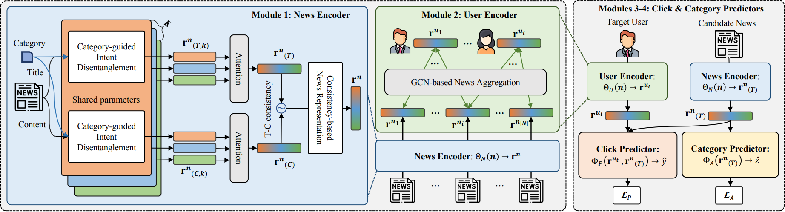

# CIDER: Category-Guided Intent Disentanglement for Accurate Personalized News Recommendations
## The overview of CIDER


## Datasets
1. MIND: [**link**]([https://drive.google.com/drive/u/2/folders/1ksV0PUncXyBnEHGPB4H4mae2ybXX3Ch0](https://msnews.github.io/))
2. Adressa: [**link**]([https://drive.google.com/drive/u/2/folders/1DHlKOhKgISw9VTYmbMvnsIbaaLRtqhbq](https://reclab.idi.ntnu.no/dataset/))

## Dependencies
Our code runs on the Intel i7-9700k CPU with 64GB memory and NVIDIA RTX 2080 Ti GPU with 12GB, with the following packages installed:
```
python 3.8.10
torch 1.12.1
torchtext 0.12.0
torch-scatter
pandas
nltk
numpy
sklearn
```

## How to run
```
python3 main.py --news_encoder=CIDER --user_encoder=CIDER
```
