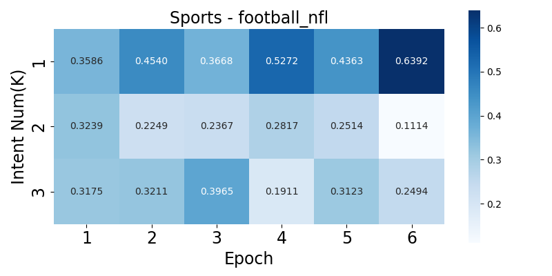
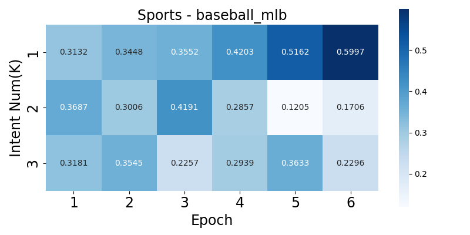
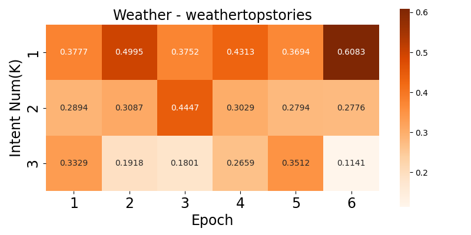
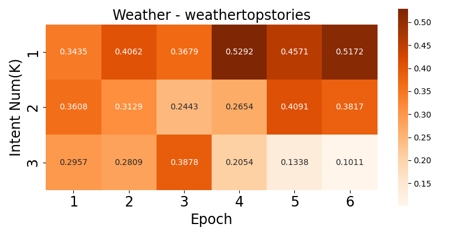

# [KDD'25] CROWN: A Novel Approach to Comprehending Users' Preferences for Accurate Personalized News Recommendation
## The overview of CROWN


<!--
## The model accuracy of CROWN according to different GNN models in MIND-small
|         | GraphSAGE | GCN    | LightGCN |
| ------- | --------- | ------ | -------- |
| AUC     | 0.6823    | 0.6813 | 0.6819   |
| MRR     | 0.3354    | 0.3348 | 0.3350   |
| nDCG@5  | 0.3697    | 0.3691 | 0.3705   |
| nDCG@10 | 0.4293    | 0.4309 | 0.4289   |

## Visualization of the attention weights on the disentangled intents(K=3)






-->

## Datasets
1. MIND: [**link**](https://msnews.github.io/)
2. Adressa: [**link**](https://reclab.idi.ntnu.no/dataset/)

## Dependencies
Our code runs on the Intel i7-9700k CPU with 64GB memory and NVIDIA RTX 2080 Ti GPU with 12GB, with the following packages installed:
```
python 3.8.10
torch 1.12.1
torchtext 0.12.0
torch-scatter
pandas
nltk
numpy
sklearn
```

## How to run
```
python3 main.py --news_encoder=CROWN --user_encoder=CROWN
```
